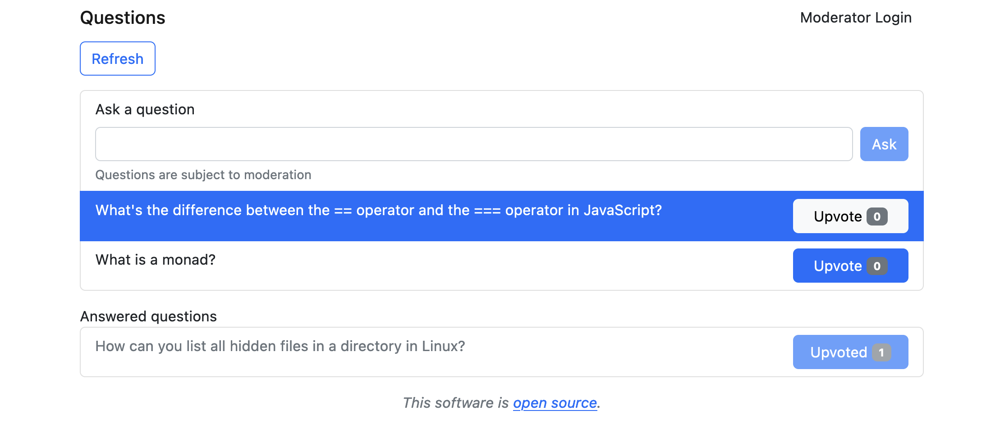

# nochfragen

A small web app for asking and moderating questions



## Introduction

Questions can be submitted by any user. Initially, questions are
hidden for non-moderators. Moderators can make hidden questions
visible and can hide visible questions. In addition, moderators can
also delete questions, making them hidden for everyone.

Any user can upvote a question, but a session cannot give more than
one upvote for a single question.

`nochfragen` uses redis as an emphemeral storage backend.

## Building

### Backend

The backend requires zig 0.10.1 and a recent version of gyro (git rev
`19cf64d` was confirmed to work).

```
gyro build
```

### Frontend

```
npm i
npm run build
```

## Usage

```
Usage: nochfragen [-h] [--listen-address <IP:PORT>] [--redis-address <IP:PORT>] [--sqlite-db <PATH>] [--root-dir <PATH>]

Options:

    -h, --help
            Display this help and exit.

        --listen-address <IP:PORT>
            Address to listen for connections

        --redis-address <IP:PORT>
            Address to connect to redis

        --sqlite-db <PATH>
            Path to the SQLite database

        --root-dir <PATH>
            Path to the static HTML, CSS and JS content

```

## Configuration

The `nochfragenctl` command-line utility is designed to configure a
(possibly runnig) nochfragen server.

```
Usage: nochfragenctl [-h] [--set-password <PASS>] [--redis-address <IP:PORT>]

Options:

    -h, --help
            Display this help and exit.

        --set-password <PASS>
            Set a new password and exit

        --redis-address <IP:PORT>
            Address to connect to redis

```

## License

`nochfragen` is licensed under the MIT (Expat) License.
