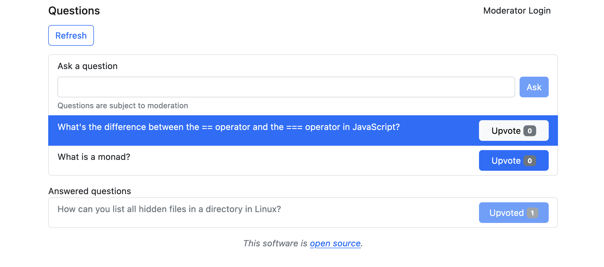

# nochfragen

A small web app for asking and moderating questions



## Introduction

Questions can be submitted by any user. Initially, questions are
hidden for non-moderators. Moderators can make hidden questions
visible and can hide visible questions. In addition, moderators can
also delete questions.

Any user can upvote a question, but a session cannot give more than
one upvote for a single question.

`nochfragen` stores questions and surveys in an SQLite database and
keeps track of sessions in Redis.

## Development

### Backend

The backend is implemented in the `backend` directory.

A recent stable rust toolchain is required. The SQLite (development)
library is also required on your system. The exact name of this
package varies in every distribution/package ecosystem.

The `nochfragen` main executable provides the backend API routes under
`/api/` and also serves frontend content from `$ROOT_DIR` (defaults to
`../build`).

```
cargo run
```

### Frontend

The frontend is written in Svelte and requires the nodejs toolchain.

First, set up an example `.env` file for the build:

```
cp .env.example .env
```

Then, build the static site:

```
npm i
npm run build
```

## Configuration

`nochfragen` is configured with environment variables:

| Environment variable | Default          | Description              |
|----------------------|------------------|--------------------------|
| `$LISTEN_ADDRESS`    | `127.0.0.1:8080` | Address to listen on     |
| `$REDIS_ADDRESS`     | `127.0.0.1:6379` | Redis connection address |
| `$DATABASE_URL`      | `db.sqlite`      | Path to SQLite database  |
| `$ROOT_DIR`          | `../build`       | Path to frontend build   |

The `nochfragenctl` command-line utility is designed to configure a
(possibly running) nochfragen server.

```
Usage: nochfragenctl <COMMAND>

Commands:
  set-password  Change the moderation password
  help          Print this message or the help of the given subcommand(s)

Options:
  -h, --help  Print help
```

## License

`nochfragen` is licensed under the MIT (Expat) License.
